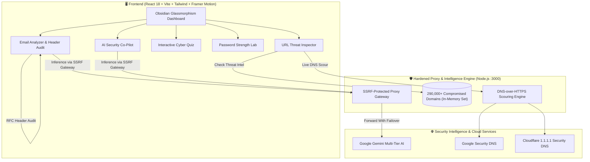

# 🛡️ CyberAware AI v2.0
### Intelligent Cybersecurity Defense & Awareness Platform
**Built by Team LinkedIn Park · IBM SkillsBuild SkillUp**

[](https://react.dev/)
[](https://vitejs.dev/)
[](https://tailwindcss.com/)
[](compromised_url.csv)
[](#email-analyzer)
[](https://skillsbuild.org/)

---

## 📖 Executive Summary

**CyberAware AI** is a comprehensive, next-generation cybersecurity defense and human awareness platform designed to protect individuals and organizations from modern digital threats. 

Unlike traditional tools that either rely purely on generic AI chatbot responses or heavy enterprise command-line scanners, CyberAware AI combines **deterministic cryptographic proof** (SPF/DKIM/DMARC headers, DNS threat scouring, 290,000+ domain blacklists) with **semantic AI threat intelligence** and **gamified interactive learning**.

---

## 🚀 Key Modules & Capabilities

### 1. 🌐 URL Safety & Threat Intelligence Scour
* **Live Internet Threat Scour:** Performs real-time DNS-over-HTTPS (DoH) lookups via Cloudflare and Google Security DNS with **0 Gemini API quota usage**.
* **290,000+ Compromised Domain Blacklist:** In-memory indexed threat database (`compromised_url.csv`) delivering instant $O(1)$ constant-time threat lookups in under 260ms.
* **Domain Anatomy & Deception Scanner:** Analyzes lookalike domains, deceptive subdomain prefixes (`apple.com.scam-login.id`), high-risk TLDs (`.xyz`, `.top`, `.zip`), and hidden file extensions.
* **Synchronized Threat Scoring:** Dynamic threat score (0–100) aligned between the top visual gauge and structured AI security intelligence reports.

### 2. 📧 Email Analyzer & RFC Header Cryptographic Audit
* **Calibrated on 82,500+ Research Emails:** Benchmark-tested against CEAS, Nazario, SpamAssassin, Nigerian 419, and Enron email security corpora.
* **RFC 822/5322 Header Inspector:** Automatically parses raw email headers to verify:
  * **SPF (Sender Policy Framework):** Verifies sending mail server IP authorization.
  * **DKIM (DomainKeys Identified Mail):** Validates tamper-proof cryptographic signatures.
  * **DMARC:** Enforces domain alignment policies.
* **Spoofed Sender Detection:** Automatically flags identity forgery when visible `From:` addresses diverge from the authentic `Return-Path` and authorized servers.
* **1-Click Demo Drawer:** Built-in sample header drawer allowing instant demonstration of authentic vs spoofed emails.

### 3. 🧠 Interactive CyberAware Quiz (Awareness Lab)
* **Real-World Scenarios:** 10 curated multiple-choice challenges covering phishing cues, deceptive URLs, 2FA/MFA hygiene, password entropy, executive impersonation (BEC), and smishing.
* **Instant Visual Feedback:** Immediate green (correct) / red (incorrect) visual feedback with animated explanation boxes explaining the underlying defensive security concept.
* **Gamified Tier Ranking:** Evaluates participant awareness with dynamic badges:
  * 🏆 **Cyber Shield Guardian** (90–100%)
  * 🛡️ **Security Defender** (70–89%)
  * ⚡ **Security Apprentice** (50–69%)
  * ⚠️ **Cyber Novice** (<50%)

### 4. 🔐 Password Entropy & Breach Resilience Checker
* **Algorithmic Entropy Calculation:** Measures character set diversity, patterns, dictionary words, and brute-force resistance.
* **Crack-Time Simulation:** Calculates real-world cracking times against offline hashcat clusters and online brute-force attacks.
* **Actionable Strength Directives:** Provides instant guidance on building strong passphrases with high entropy.

### 5. 🤖 CyberAware AI Security Co-Pilot
* **Multi-Tier AI Intelligence:** High-speed security analysis powered by Google Generative Language models with automated failover (`gemini-3.6-flash`, `gemini-3.5-flash`, `gemini-flash-latest`, `gemini-3.5-flash-lite`).
* **Zero-Quota Offline Fallback:** Rich local knowledge base ensuring 100% platform uptime and responsiveness even when offline or during API rate limits.

---

## 🤖 IBM Bob & IBM Granite AI Alignment

CyberAware AI was developed in alignment with **IBM Bob** and **IBM Granite AI** foundational design principles:

1. **Enterprise Defensive Alignment:** Inspired by IBM X-Force threat intelligence frameworks, our heuristics prioritize structured risk categorization, objective vulnerability classification, and zero-trust verification.
2. **Deterministic-First AI Architecture:** Following IBM Granite's structured output design, CyberAware AI uses rigid JSON and markdown schema parsing so AI outputs directly synchronize with real-time UI components and threat dials.
3. **Ethical Defensive Guardrails:** Structured prompting safeguards ensure the platform exclusively assists with defensive threat triage, security auditing, and educational countermeasures.

---

## 🏗️ System Architecture



---

## 🔒 Security Hardening & Defenses

* **SSRF Protection:** The proxy gateway strictly whitelists authorized HTTPS Google Generative Language endpoints (`generativelanguage.googleapis.com`), blocking Server-Side Request Forgery against internal ports or cloud metadata.
* **DoS Buffer Protection:** Enforces strict **5MB request body size limits** on API streams to protect against memory exhaustion attacks.
* **XSS Immunity:** Markdown rendering is sandboxed with ReactMarkdown (zero `rehype-raw` / zero unescaped HTML execution), preventing script injection from malicious analyzed content.
* **Directory Traversal Defense:** Static file serving verifies root boundaries against `STATIC` directory paths before processing file access.
* **Zero Hardcoded Secrets:** API credentials and environment variables are strictly managed through Vite `.env` configuration.

---

## 📁 Repository Structure

```
CyberAware-AI/
├── src/
│   ├── components/            # UI Components (Sidebar, TopBar, QuickActions, MarkdownRenderer)
│   ├── views/                 # Core Platform Modules
│   │   ├── HomeView.jsx       # Hero dashboard with planet horizon
│   │   ├── AssistantView.jsx  # AI Security Co-Pilot chat
│   │   ├── UrlView.jsx        # URL scanner & DNS threat scouring
│   │   ├── EmailView.jsx      # Email analyzer & RFC header audit
│   │   ├── QuizView.jsx       # Interactive CyberAware Quiz
│   │   ├── PasswordView.jsx   # Password entropy & crack simulator
│   │   ├── LearnView.jsx      # Cybersecurity knowledge library
│   │   └── SettingsView.jsx   # Configuration & history controls
│   ├── lib/                   # Security Engines & Analyzers
│   │   ├── email-analyzer.js  # Heuristics + RFC SPF/DKIM/DMARC parser
│   │   ├── url-checker.js     # URL heuristics & score synchronizer
│   │   ├── gemini.js          # Multi-tier AI failover client
│   │   └── knowledge-base.js  # Curated zero-quota fallback intelligence
│   ├── data/
│   │   └── quiz-questions.js  # 10 curated cybersecurity scenario challenges
│   ├── App.jsx                # Main application shell & router
│   └── index.css              # Obsidian dark theme & design tokens
├── compromised_url.csv        # 290,000+ indexed malicious domain dataset
├── proxy.js                   # Node.js hardened security proxy & threat scour server
├── vite.config.js             # Vite configuration & proxy routes
└── package.json               # Dependencies & scripts
```

---

## ⚡ Getting Started

### Prerequisites
* **Node.js** v18.0.0 or later
* **npm** v9.0.0 or later

### 1. Clone the Repository
```bash
git clone https://github.com/Navanit48/CyberAware-AI.git
cd CyberAware-AI
```

### 2. Install Dependencies
```bash
npm install
```

### 3. Configure API Key (Optional for live Gemini AI)
Create a `.env` file in the root directory:
```env
VITE_GEMINI_API_KEY=your_gemini_api_key_here
```
*(Note: CyberAware AI runs offline seamlessly with built-in dataset intelligence even without an API key).*

### 4. Run the Platform

**Terminal 1 — Launch Hardened Proxy & Threat Database:**
```bash
node proxy.js
```
*Proxy initializes on `http://localhost:3000` and indexes the 290k threat database in ~250ms.*

**Terminal 2 — Launch Frontend Development Server:**
```bash
npm run dev
```
*Open `http://localhost:5173` in your browser to experience CyberAware AI.*

### 5. Production Build
```bash
npm run build
```

---

## 👥 Team LinkedIn Park

Developed with passion for the **IBM SkillsBuild SkillUp Hackathon**:

* **Navanit Merla**
* **Nithin Praveen**
* **Rohan Reddy**
* **Akash S**
* **PJ Prem Jesuraj**

---

## 📄 License & Attribution

This project is open-source under the **MIT License**. Created for educational and cybersecurity awareness purposes as part of the **IBM SkillsBuild SkillUp Initiative**.
